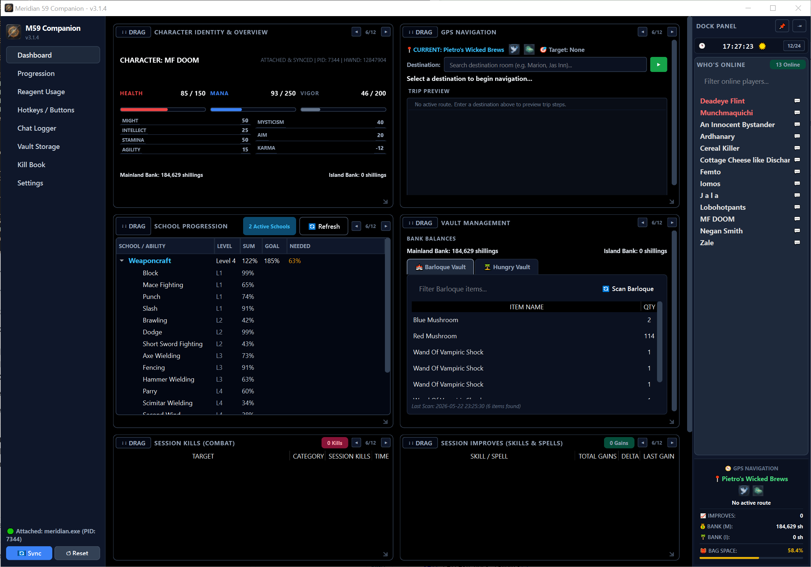
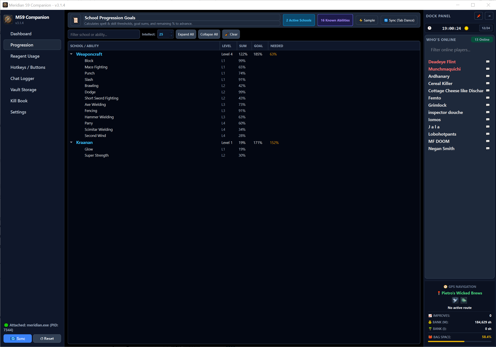
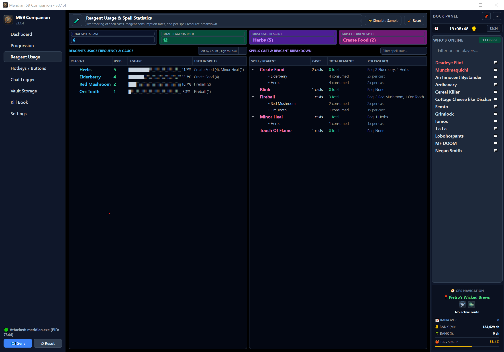
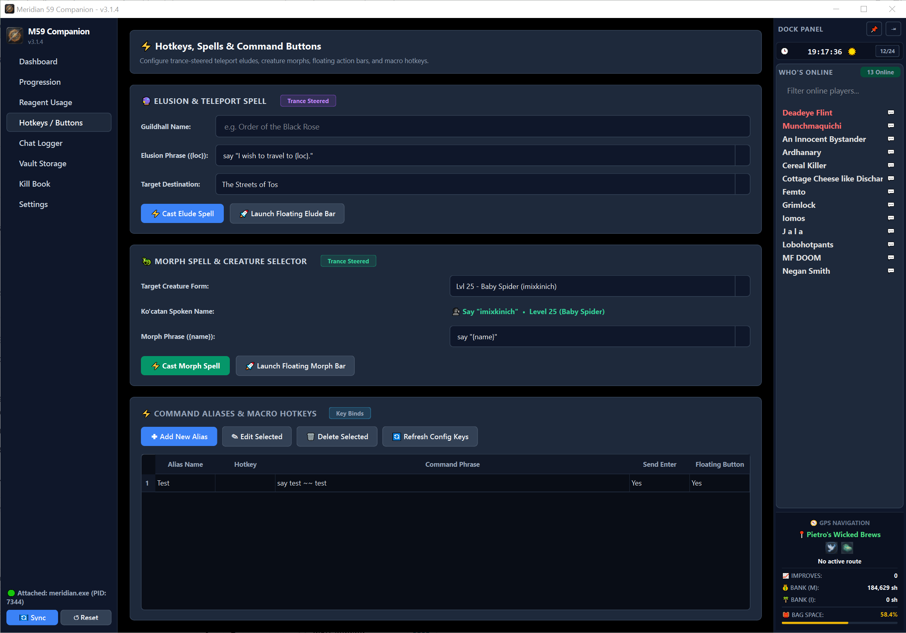
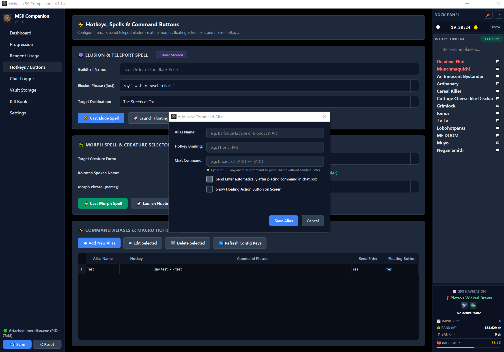
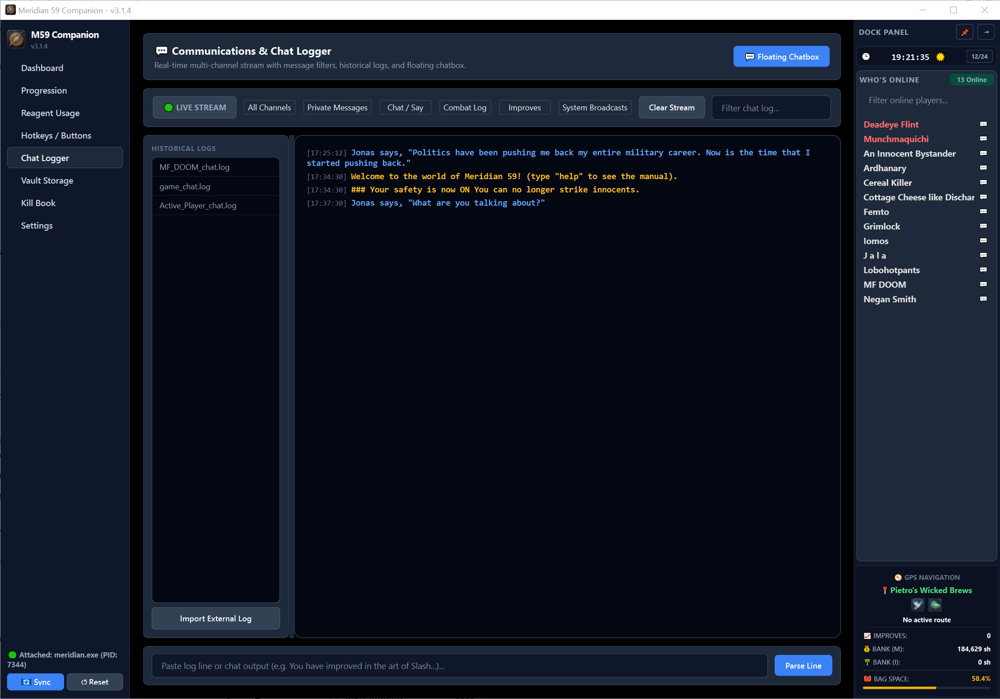
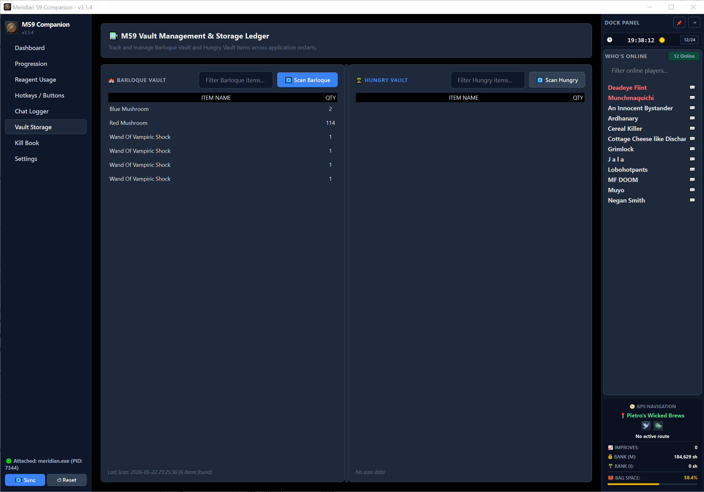
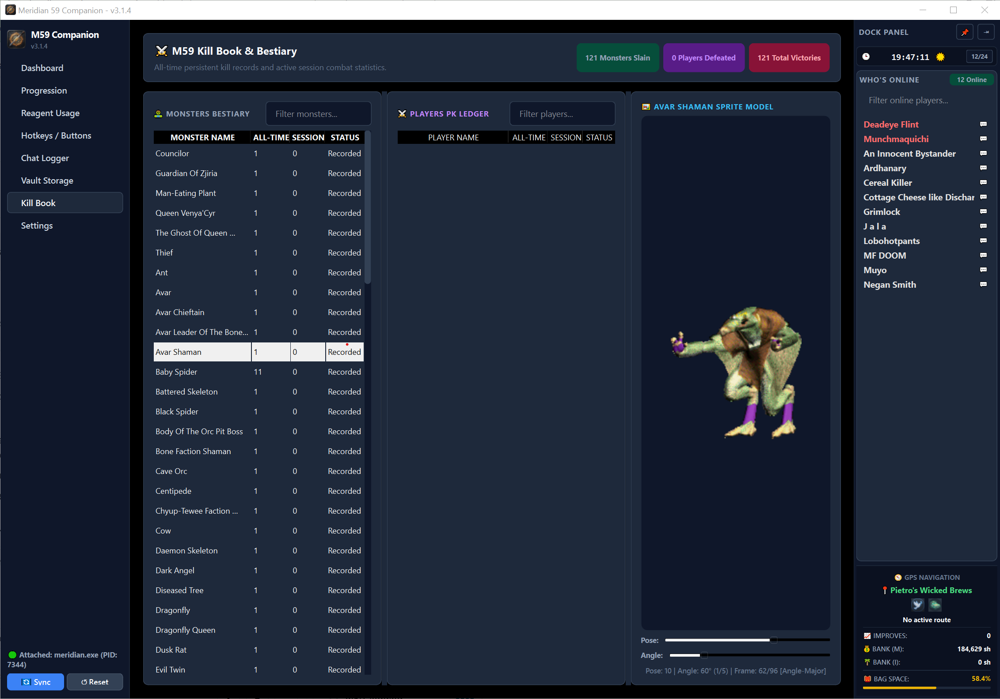
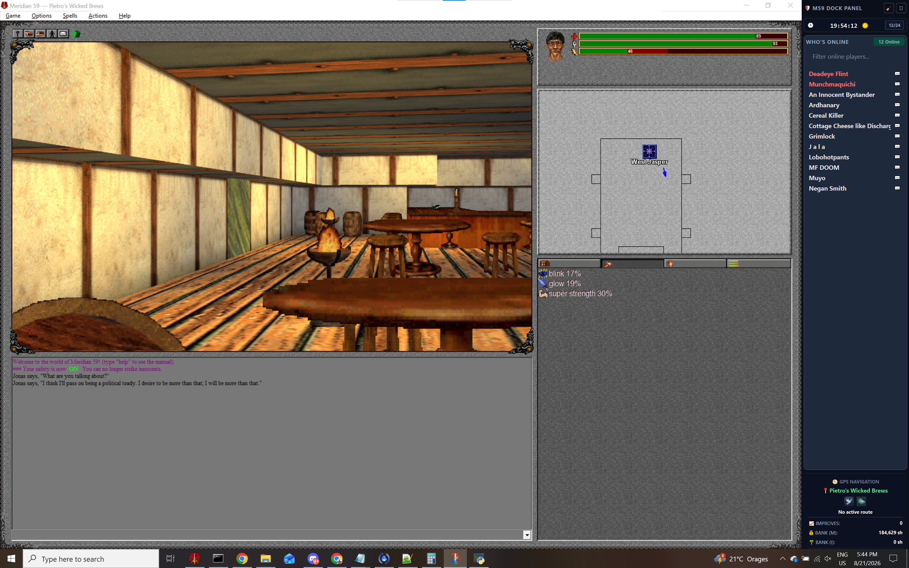

# Meridian 59 Companion

A modern, high-performance PySide6/Qt companion dashboard and overlay suite for **Meridian 59**. Featuring real-time client memory synchronization, precise spell & skill progression calculations, floating game overlays, automated GPS pathfinding, reagent consumption analytics, cross-session vault ledgers, Underworld Mana Node solver, and multi-channel chat logging with audible DM alerts.

---

### 📥 Direct Download

- **🚀 Latest Release**: [Download M59Companion.exe (v3.1.13)](https://github.com/subvhome/m59-companion-v3/raw/main/dist/M59Companion.exe)

---

### ✨ Comprehensive Feature Highlights

- **🔊 Audible DM Alerts**: Instant audio notifications whenever you receive a direct message from another player, ensuring you never miss a message while tabbed out or in combat.
- **💬 Direct Message Chat Boxes**: Dedicated private message popups and messaging tabs for seamless 1-on-1 player communication without cluttering main game text.
- **🖼️ Floating Chat Overlay with Filters**: Re-sizable and positionable transparent floating chat window designed to overlay directly on top of the Meridian 59 game client. Includes custom channel toggles (Private Messages, Say/Chat, Combat Log, Improves, System Broadcasts) and quick text filtering.
- **🎯 Precise School Progression Tracker**: Accurate calculation of spell and skill advancement thresholds, goal percentage sums, and remaining percentage requirements down to the exact percentage—unlike standard external tools that rely on rough approximations. Features Intellect attribute scaling and school expand/collapse trees.
- **🌀 Underworld Mana Node Resolver**: Interactive pentagram star room solver that calculates the exact ordered brazier activation sequence to solve the Underworld puzzle and open the Mana Node portal.
- **🧪 Reagent Usage & Spell Analytics (Beta - User Feedback Needed)**: Real-time spell casting statistics tracking total spells cast, reagent consumption share gauges, per-spell resource requirement trees, and session reset counters.
- **📜 Multi-Channel Chat Logger & Parser**: Live-streaming chat reader, historical log manager (`.log` viewer), external log file importer, and manual chat line parser.
- **⚡ Hotkeys, Spells & Command Buttons**: Trance-steered teleport elusion shortcuts, creature morph spell selector, customizable macro hotkeys, and floating action buttons.
- **🏦 Vault Management & Storage Ledger**: Persistent inventory ledger tracking items across Barloque Vault and Hungry Vault with real-time item search and scan synchronization.
- **📖 Kill Book & Bestiary**: Comprehensive all-time and active session monster slay tracker, player PK ledger, total victory metrics, and an interactive sprite viewer.
- **📌 Dockable Overlay Panel**: Compact, pinable side panel snapped directly alongside the game client (showcased in `screen8.png`) displaying real-time clock (12/24h), Who's Online list with direct message triggers, active GPS navigation route preview, bank balances, bag space capacity, and session improves.

---

### 📸 Application Previews

#### 1. Main Dashboard Overview

*Central command center featuring Character Identity & Stats (Health/Mana/Vigor), GPS Navigation route preview, School Progression summary, Vault Balances, Session Combat Kills, Session Skill Improves, and the attached Dock Panel.*

#### 2. School Progression Goals Tracker

*Real-time school progression goal calculator displaying accurate percentage thresholds, goal target sums, Intellect attribute modifiers, and remaining percentage requirements needed to advance.*

#### 3. Reagent Usage & Spell Analytics (Beta)

*Live spell casting analytics dashboard showcasing total cast counters, reagent consumption share gauges, most-used reagent highlights, and per-spell resource requirement trees.*

#### 4. Hotkeys, Spells & Command Buttons

*Configuration screen for trance-steered teleport eludes, creature morph selectors, floating action bars, and customizable command alias hotkeys.*

#### 5. Command Alias & Macro Creator

*Modal dialog for creating custom command aliases with key binding shortcuts and floating screen buttons.*

#### 6. Communications & Chat Logger

*Real-time multi-channel chat log stream with category filters (Private Messages, Say, Combat, Improves, Broadcasts), historical log parser, and floating chat overlay launcher.*

#### 7. Vault Management & Storage Ledger

*Cross-session vault management interface for searching and tracking item inventories stored in the Barloque Vault and Hungry Vault.*

#### 8. Kill Book & Bestiary with Sprite Viewer

*All-time and session monster kill ledger, player PK tracker, total victory statistics, and an interactive sprite viewer.*

#### 9. Dockable Panel Game Overlay

*Showcasing the compact dockable panel snapped seamlessly alongside the Meridian 59 game client, providing in-game time, Who's Online list with direct DM buttons, GPS route tracking, and character status gauges.*
